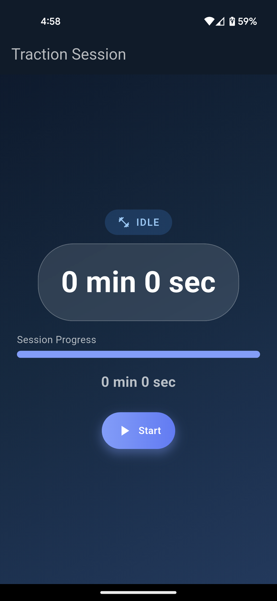

# Cervical Tracker App

## 📌 Overview
Cervical Tracker is a simple and practical mobile application built to assist users undergoing cervical traction therapy.

This app was created to solve a real-world problem. My father, who suffered a spinal cord injury, needed to regularly use a Cervical Traction Kit. The therapy requires a structured timing cycle:
- Total duration: 20 minutes
- Every 5 minutes: short rest of 5–10 seconds

Manually tracking this repeatedly was inconvenient and error-prone. To address this, I developed this application.

---

## 🚀 Features
-  Automatic interval management (5-minute cycles)
- 🔊 Loud voice announcements for:
  - Start of session
  - Rest intervals
  - Resume alerts
  - Session completion
- 👤 Simple and user-friendly interface
- ⚙️ Designed for ease of use, especially for elderly users

---

## 💡 Problem Solved
Tracking therapy intervals manually can be difficult, especially for patients. This app automates the entire process, ensuring:
- Accurate timing
- Hands-free operation
- Improved focus on therapy instead of time tracking

---

## 🏗 Architecture

This project follows a **feature-based clean architecture** with separation of concerns:
---

### 🔁 State Management
- Implemented using **BLoC (Cubit)**
- Handles:
  - Timer logic
  - Phase transitions (traction ↔ rest)
  - UI state updates

### 🎯 Key Design Decisions
- Feature-based folder structure for scalability
- Separation between UI, business logic, and data handling
- Reusable widgets for cleaner UI code

---

## 🛠 Tech Stack
- Flutter (Dart)
- Local device features (Audio / Timer)

---

## 🎯 Use Case
Although built for personal use, this app can be used by:
- Patients undergoing cervical traction therapy
- Physiotherapy routines requiring timed intervals
- Anyone needing structured interval-based timers

---

## 📱 Key Screens & Components
- `traction_screen.dart` → Main UI
- `timer_display.dart` → Live timer UI
- `phase_indicator.dart` → Shows current phase
- `control_buttons.dart` → Start/Stop controls
- `traction_cubit.dart` → Core logic handler
---

## 📷 Screenshots



---

## 📦 Installation
```bash
git clone https://github.com/lijith006/Cervical-tracker-app.git
cd Cervical-tracker-app
flutter pub get
flutter run